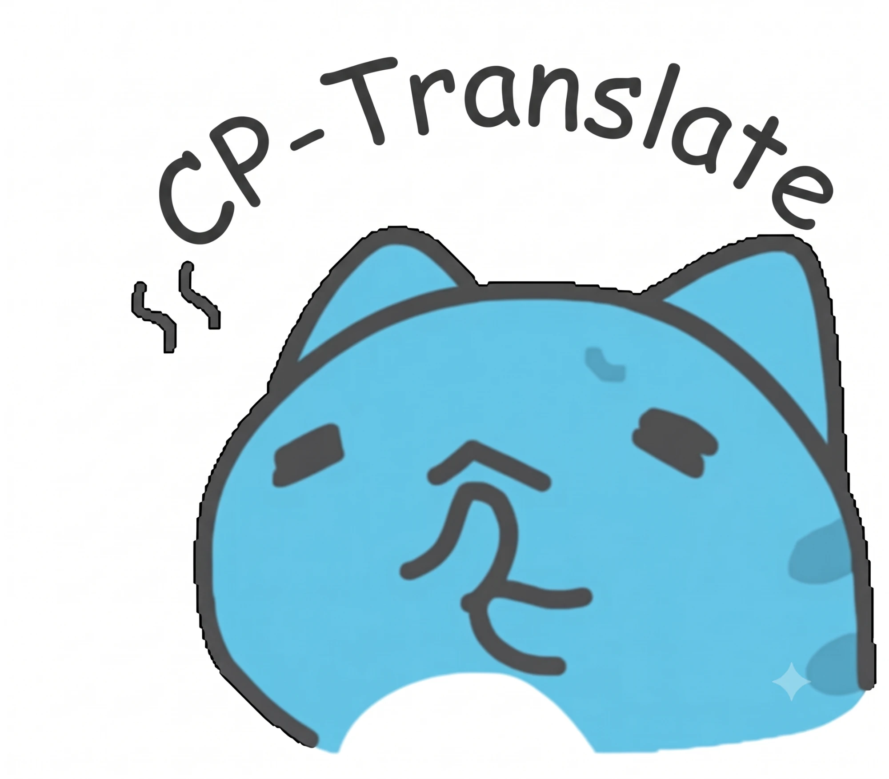
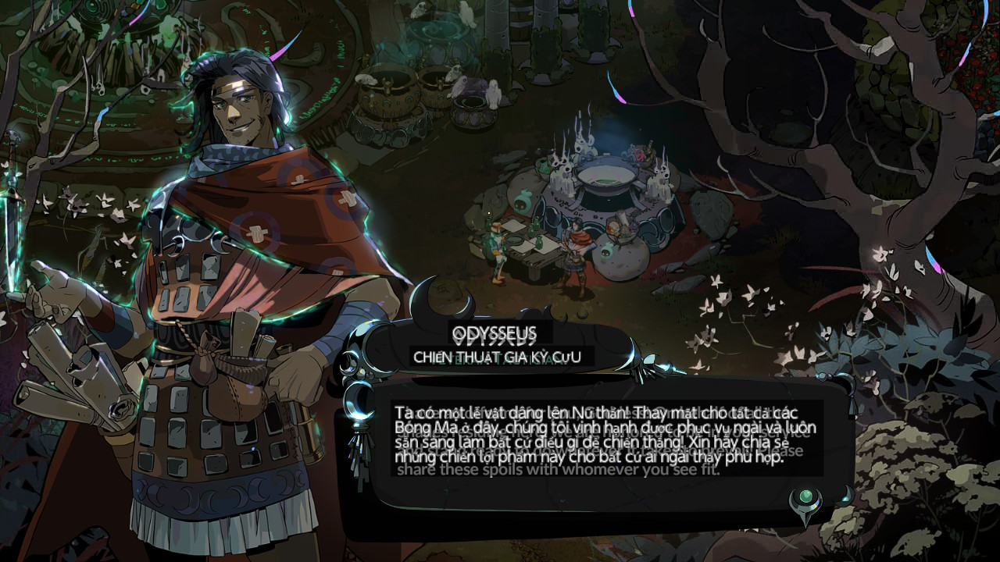
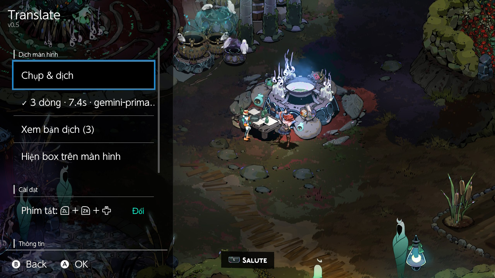

<p align="center">
  
</p>

<h1 align="center">CP-Translate</h1>

<p align="center">
  Overlay dịch màn hình game ngay trên Nintendo Switch (CFW).<br>
  Bấm một tổ hợp phím → chụp màn hình → AI đọc chữ và dịch → bản dịch hiện đè lên đúng chỗ chữ gốc.
</p>

---

## Mục đích

Nhiều game Switch không có tiếng Việt, hoặc chỉ có tiếng Nhật/Anh. CP-Translate giúp bạn đọc hiểu hội thoại,
menu, nhiệm vụ... **ngay trong lúc chơi** mà không phải cầm điện thoại chụp màn hình rồi tra.

- Chạy như một **overlay Tesla/Ultrahand**: không cần thoát game, không cần PC bên cạnh.
- **OCR + dịch trong một bước** bằng model AI có khả năng đọc ảnh (Gemini, ChatGPT/Claude qua router).
- Bản dịch hiển thị **đúng vị trí** chữ gốc trên màn hình, chạm là ẩn.
- API key nằm trên server, **không lưu trên Switch**.

<p align="center">
  
  
</p>
<p align="center">
  <sub>Trái: bản dịch hiện đè lên hộp thoại trong game · Phải: menu overlay với trạng thái dịch và phím tắt</sub>
</p>

## Chức năng chính

| | |
|---|---|
| 🎮 **Phím tắt khi đang chơi** | Mặc định `L + R + ZR`, bấm lúc overlay đang ẩn để chụp & dịch |
| 🖼️ **Box dịch toàn màn hình** | Box đen trong suốt ~70%, chữ trắng, tự xuống dòng và co cỡ chữ cho vừa box |
| 👆 **Chạm để ẩn** | Chạm màn hình hoặc bấm nút bất kỳ để ẩn hết box và chơi tiếp |
| 📜 **Xem lại bản dịch** | Danh sách bản gốc + bản dịch trong menu overlay |
| ⌨️ **Đổi phím tắt** | Giữ tổ hợp mới 1.5 giây ngay trong overlay, tự lưu vào `config.ini` |
| 🔁 **Fallback nhiều AI** | Server thử lần lượt nhiều provider theo độ ưu tiên, lỗi/timeout thì chuyển provider khác |
| 🇻🇳 **Font tiếng Việt** | Nạp font TTF từ thẻ SD cho các ký tự font hệ thống thiếu (ấ, ặ, ữ, ✓...) |
| 🩺 **Kiểm tra mạng** | Xem trạng thái Wi-Fi, IP, DNS ngay trong overlay |

## Kiến trúc

```
┌──────────── Nintendo Switch (overlay .ovl) ────────────┐          ┌──────── Netlify Function (Node.js) ─────────┐
│                                                         │  HTTPS   │                                             │
│  L+R+ZR ─► chụp màn hình (caps:sc, JPEG 1280x720)       │ ───────► │  POST /api/translate                        │
│            │                                            │  ảnh +   │   ├─ kiểm tra x-app-token                   │
│            ▼                                            │  token   │   ├─ nhận diện ảnh (JPEG/PNG/WebP)          │
│  gửi lên server (libcurl, TLS hệ thống)                 │          │   └─ FallbackTranslator                     │
│            │                                            │          │        ├─ priority 1: Gemini flash-lite     │
│            ▼                                            │ ◄─────── │        ├─ priority 2: Gemini flash          │
│  parse JSON (jansson) ─► vẽ box lên màn hình            │   JSON   │        └─ priority 3: router (OpenAI API)   │
│                                                         │          │                                             │
└─────────────────────────────────────────────────────────┘          └─────────────────────────────────────────────┘
```

```
.
├─ overlay/          Frontend: overlay Tesla chạy trên Switch (C++ / libnx)
├─ backend/          Backend: Netlify Function (Node.js / TypeScript)
├─ netlify.toml      Cấu hình deploy Netlify
└─ docs/             Hình ảnh cho README
```

---

## Cài đặt

### Yêu cầu

- Nintendo Switch đã cài **Atmosphère**
- **Ultrahand Overlay** (hoặc Tesla Menu + nx-ovlloader)
- Kết nối **Wi-Fi** có Internet
- Một **backend** đã deploy (xem [Backend](#backend-netlify-function)) và `APP_TOKEN` của nó

### 1. Cài overlay lên thẻ SD

Tải `translate.ovl` (hoặc tự build, xem [Frontend](#frontend-overlay-switch)) rồi chép vào thẻ SD theo cấu trúc:

```
SD:\
├─ switch\
│  └─ .overlays\
│     └─ translate.ovl
└─ config\
   └─ translate\
      ├─ config.ini        ← cấu hình (bắt buộc)
      └─ DejaVuSans.ttf    ← font tiếng Việt (khuyến nghị)
```

### 2. Tạo `config.ini`

Chép [`overlay/config.ini.example`](overlay/config.ini.example) thành `SD:\config\translate\config.ini` và điền:

```ini
url=https://<ten-site>.netlify.app/api/translate
token=<APP_TOKEN của backend>
lang=Vietnamese
hotkey=L+R+ZR
```

> ⚠️ `config.ini` chứa token, **không chia sẻ** file này.

### 3. Font tiếng Việt

Font hệ thống của Switch thiếu nhiều ký tự tiếng Việt. Tải **DejaVu Sans**
tại <https://dejavu-fonts.github.io/Download.html>, lấy file `ttf/DejaVuSans.ttf` và chép vào
`SD:\config\translate\`. Overlay sẽ dùng file `.ttf` đầu tiên tìm thấy trong thư mục này.

---

## Hướng dẫn sử dụng

1. Vào game, mở menu overlay (Ultrahand mặc định: `ZL + ZR + ↓`) và chọn **Translate**.
2. Bấm **B** để ẩn overlay. *Đừng chọn "Thoát overlay", nếu không phím tắt sẽ không hoạt động.*
3. Khi gặp đoạn cần dịch, bấm **`L + R + ZR`**.
4. Sau vài giây, bản dịch hiện đè lên màn hình.
5. **Chạm màn hình** hoặc **bấm nút bất kỳ** để ẩn box và chơi tiếp.

### Menu overlay

| Mục | Chức năng |
|---|---|
| **Chụp & dịch** | Dịch màn hình hiện tại ngay từ menu |
| *Dòng trạng thái* | Kết quả gần nhất, vd `✓ 5 dòng · 2.4s · gemini-primary`, hoặc thông báo lỗi |
| **Xem bản dịch (N)** | Danh sách bản gốc (xám) và bản dịch (trắng) |
| **Hiện box trên màn hình** | Hiện lại box của bản dịch gần nhất |
| **Phím tắt** | Đổi tổ hợp phím: giữ 2-4 nút khoảng 1.5 giây để lưu, bấm riêng B để huỷ |
| **Kiểm tra mạng** | Trạng thái Wi-Fi, IP và kết quả phân giải DNS tới server |
| **Thoát overlay** | Tắt hẳn overlay, quay về menu Ultrahand |

### Xử lý lỗi thường gặp

| Thông báo | Cách xử lý |
|---|---|
| `Thiếu file config.ini` / `thiếu url` / `thiếu token` | Kiểm tra đường dẫn và nội dung `config.ini` |
| `Mạng: Couldn't resolve host` | Kiểm tra Wi-Fi và chính tả `url`, dùng **Kiểm tra mạng** |
| `Server 401: Invalid app token` | `token` không khớp `APP_TOKEN` trên server |
| `Server 502: All providers failed \| ...` | Tất cả AI đều lỗi. Phần sau dấu `\|` là lỗi của từng provider |
| Ký tự tiếng Việt hiện ô vuông | Chưa có font `.ttf` trong `SD:\config\translate\` |
| Overlay crash (2168-xxxx) | Gửi file mới nhất trong `SD:\atmosphere\crash_reports\` khi báo lỗi |

---

## Danh sách chức năng

**Overlay (Switch)**

- [x] Chụp màn hình lớp game, không dính overlay (`ViLayerStack_ApplicationForDebug`)
- [x] Phím tắt toàn cục khi overlay đang ẩn, đổi được và lưu vào `config.ini`
- [x] Gửi ảnh qua HTTPS bằng libcurl (TLS của hệ thống, không cần CA bundle)
- [x] Parse JSON kết quả (jansson)
- [x] Tự bật overlay khi dịch xong
- [x] Box dịch toàn màn hình: đen ~70%, chữ trắng, tự xuống dòng, co cỡ chữ theo box
- [x] Chạm hoặc bấm nút để ẩn, tự trả lại RAM framebuffer fullscreen
- [x] Tự hạ độ phân giải framebuffer (1280x720 → 960x540 → 640x360) khi thiếu RAM
- [x] Danh sách bản dịch với tự xuống dòng
- [x] Font fallback tiếng Việt từ thẻ SD
- [x] Kiểm tra mạng (Wi-Fi, IP, DNS)
- [x] Hiện lỗi chi tiết của từng provider

**Backend (Netlify)**

- [x] `POST /api/translate` nhận ảnh JPEG / PNG / WebP (tối đa 2 MB), tự đọc kích thước thật
- [x] Xác thực bằng header `x-app-token` (so sánh an toàn thời gian)
- [x] Adapter + factory: thêm provider mới chỉ cần một file adapter
- [x] Fallback theo priority, timeout riêng cho từng provider và tổng thời gian
- [x] Adapter **Gemini** (REST, toạ độ `box_2d` chuẩn hoá) và **OpenAI-compatible** (`/v1/chat/completions`)
- [x] Chuẩn hoá toạ độ về pixel, lọc output lỗi của model
- [x] Trả `provider` và `attempts` để debug

---

## Frontend: overlay Switch

Mã nguồn trong [`overlay/`](overlay/), viết bằng C++20 trên **libnx** + **libtesla** (bản đã chỉnh sửa trong `overlay/libs/libtesla`).

```
overlay/source/
├─ main.cpp                 Khởi tạo service, phím tắt, hook show/hide
├─ config.hpp               Đường dẫn SD, phiên bản, phím tắt mặc định
├─ core/                    Phần xử lý (không phụ thuộc GUI)
│  ├─ capture.*             Chụp màn hình JPEG qua caps:sc
│  ├─ http.*                HTTPS POST (libcurl), kiểm tra mạng
│  ├─ translate_client.*    Gọi /api/translate, parse JSON
│  ├─ settings.*            Đọc/ghi config.ini
│  ├─ storage.*             Ghi file lên thẻ SD
│  └─ util.hpp
├─ app/
│  ├─ translate_service.*   Thread nền: chụp → gửi → lưu kết quả
│  └─ hotkey.*              Phím tắt (đọc/ghi config.ini, dùng được từ mọi thread)
└─ gui/
   ├─ main_gui.*            Menu chính
   ├─ box_gui.*             Box dịch toàn màn hình
   ├─ result_gui.*          Danh sách bản dịch
   ├─ hotkey_gui.*          Màn hình đổi phím tắt
   └─ text_layout.*         Xuống dòng theo độ rộng chữ thật
```

**Thay đổi so với libtesla gốc** (`overlay/libs/libtesla/include/tesla.hpp`):
font fallback từ SD, `Renderer::measureString`, chuyển layout panel ↔ fullscreen lúc chạy,
`Overlay::requestShow()`, hook `onHiddenInput()` / `onHidden()`, bỏ overlay khỏi layer stack `ApplicationForDebug`.

### Build

Cài [devkitPro](https://devkitpro.org/wiki/Getting_Started) (chọn *Switch Development*), rồi cài thư viện:

```bash
pacman -S --needed switch-curl switch-zlib switch-jansson
```

Build:

```bash
cd overlay
make
```

Kết quả: `overlay/translate.ovl`.

---

## Backend: Netlify Function

Mã nguồn trong [`backend/`](backend/), Node.js 22 + TypeScript, không phụ thuộc SDK (gọi REST bằng `fetch`).

```
backend/
├─ netlify/functions/translate.mts   Endpoint POST /api/translate
├─ src/
│  ├─ config.ts                      Danh sách provider + priority (secret đọc từ env)
│  ├─ translator.ts                  FallbackTranslator
│  ├─ prompt.ts                      Prompt chung + parse/chuẩn hoá JSON
│  ├─ image.ts                       Nhận diện JPEG/PNG/WebP, đọc kích thước
│  └─ providers/
│     ├─ types.ts                    Interface TranslationProvider
│     ├─ factory.ts                  Tạo adapter theo cấu hình
│     ├─ gemini.ts                   Adapter Gemini
│     ├─ openai-compatible.ts        Adapter /v1/chat/completions
│     └─ http.ts
└─ scripts/test-image.ts             Test nhanh trên PC
```

### API

```http
POST /api/translate
x-app-token: <APP_TOKEN>
x-target-lang: Vietnamese
Content-Type: image/jpeg

<bytes ảnh>
```

```json
{
  "lines": [
    { "x": 115, "y": 520, "w": 879, "h": 126, "source": "The castle gate is locked.", "translation": "Cổng lâu đài bị khóa rồi." }
  ],
  "provider": "gemini-primary",
  "attempts": [{ "provider": "gemini-primary", "ok": true, "ms": 2448 }]
}
```

Toạ độ tính theo pixel của ảnh gửi lên (ảnh chụp Switch là 1280x720).

### Biến môi trường

| Biến | Bắt buộc | Mô tả |
|---|---|---|
| `APP_TOKEN` | ✅ | Chuỗi bí mật, Switch gửi qua `x-app-token` |
| `GEMINI_API_KEY` | | Key Gemini (dùng cho priority 1 và 2) |
| `GEMINI_MODEL_PRIMARY` | | Mặc định `gemini-3.5-flash-lite` |
| `GEMINI_MODEL_FALLBACK` | | Mặc định `gemini-3-flash-preview` |
| `ROUTER_BASE_URL` / `ROUTER_API_KEY` / `ROUTER_MODEL` | | Endpoint chuẩn OpenAI `/v1/chat/completions` |
| `PROVIDER_TIMEOUT_MS` | | Timeout mỗi provider, mặc định `12000` |
| `TOTAL_TIMEOUT_MS` | | Tổng thời gian fallback, mặc định `25000` |

Provider nào thiếu key/model sẽ tự bị bỏ qua. Mẫu: [`backend/.env.example`](backend/.env.example).

### Chạy local

```bash
cd backend
npm install
cp .env.example .env      # rồi điền key
npm run test:image -- path/to/screenshot.jpg
```

Chạy server local (cần `npm i -g netlify-cli`), từ thư mục gốc repo:

```bash
netlify dev               # http://localhost:8888/api/translate
```

### Deploy

1. Netlify → **Add new project** → **Import from GitHub** → chọn repo (cấu hình lấy từ `netlify.toml`).
2. **Project configuration → Environment variables**: thêm các biến ở trên.
3. **Access & security → Visitor access**: để *No protection* (API đã được bảo vệ bằng `APP_TOKEN`).
4. Mỗi lần `git push` lên `main`, Netlify tự build và deploy.

---

## Bảo mật

- **Không commit** `backend/.env` và `config.ini` (đã có trong `.gitignore`).
- Key AI chỉ nằm trên Netlify; Switch chỉ giữ `APP_TOKEN`. Request sai token bị chặn trước khi gọi AI.
- Nếu lỡ lộ key hoặc token: tạo key mới, cập nhật Netlify và `config.ini`.

## Ghi chú

- Dự án dành cho mục đích cá nhân, học tập. Chỉ dùng trên máy và game bạn sở hữu.
- Chất lượng bản dịch và độ chính xác vị trí box phụ thuộc vào model AI.
- Mỗi lần dịch là một request tới API của nhà cung cấp AI và có thể phát sinh chi phí hoặc giới hạn quota.

## Giấy phép

Overlay dùng [libtesla](https://github.com/WerWolv/libtesla) (GPL-2.0), nên phần overlay được phân phối theo **GPL-2.0**.
Xem [`overlay/LICENSE`](overlay/LICENSE) và [`overlay/libs/libtesla/LICENSE`](overlay/libs/libtesla/LICENSE).
